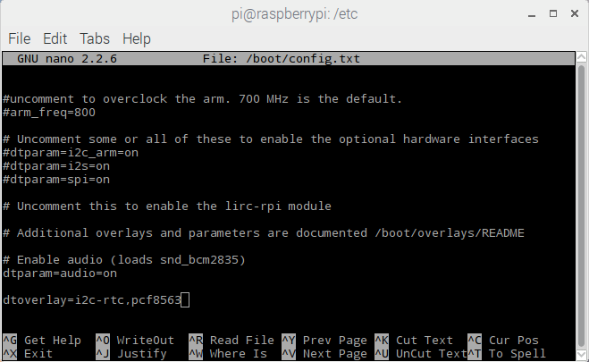
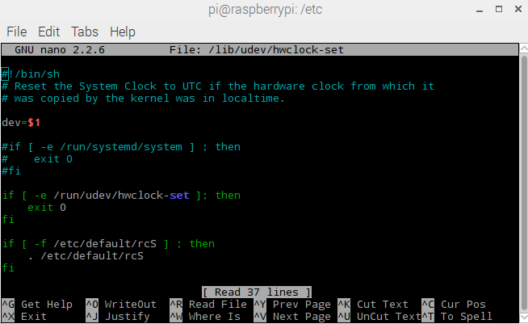
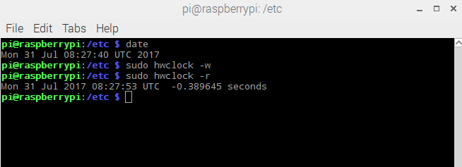

# Adding a Real-Time Clock on Raspbian Jessie

The Raspberry Pi is designed to be an ultra-low cost computer, so a lot of things we are used to on a computer have been left out. For example, your laptop and computer have a little coin-battery-powered 'Real Time Clock'  (RTC) module, which keeps time even when the power is off, or the battery removed. To keep costs low and the size small, an RTC is not included with the Raspberry Pi. Instead, the Pi is intended to be connected to the Internet via Ethernet or WiFi, updating the time automatically from the global ntp (nework time protocol) servers

For stand-alone projects with no network connection, you will not be able to keep the time when the power goes out. So in this project we will show you how to add a low cost battery-backed RTC to your Pi to keep time and introduce what our pi-desktop deb package do to sync time from RTC.

## Raspbian Jessie (Systemd)

### Step1:Adding a device tree overlay
You can add support for the RTC by adding a device tree overlay. Run

	sudo nano /boot/config.txt

to edit the pi configuration and add:

	dtoverlay=i2c-rtc,pcf8563

to the end of the file.

Save it and run `sudo reboot` to start again.

### Step2: Disable the "fake hwclock" service

	sudo systemctl disable fake-hwclock.service

### Step3: comment out three lines in hwclock-set
	
Run `sudo nano /lib/udev/hwclock-set` and comment out these three lines:

	#if [ -e /run/systemd/system ] ; then
	# exit 0
	#fi

### Step4: Sync time from Pi to RTC

You can set the correct time easily. First run date to verify the time is correct. Plug in Ethernet or WiFi to let the Pi sync the right time from the Internet. Once that's done, run `sudo hwclock -w` to write the time, and another `sudo hwclock -r` to read the time

Once the time is set, make sure the coin cell battery is inserted so that the time is saved. You only have to set the time once.
That's it! Next time you boot the time will automatically be synced from the RTC module.

### Step5: Update RTC date when reboot and poweroff

we’ll need to set up a systemd service. This will cause systemd to execute a script called sync-hwclock to run `sudo hwclock -w` on reboot and poweroff.

	[Unit]
	Description=Reboot test
	DefaultDependencies=no
	Before=shutdown.target

	[Service]
	Type=oneshot
	ExecStart=/bin/bash /usr/share/PiDesktop/script/sync-hwclock

	[Install]
	WantedBy=reboot.target poweroff.target	

## What pi-desktop deb package do

We have organized three steps from step 1 to step 3 in a script file. So you don't need to do it any more.After you installed the deb package and reboot pi you can read the time directly from the RTC with `sudo hwclock -r`. In the deb package we also set up a systemd service called sync-hwclock to write the latest time into RTC on boot and poweroff.