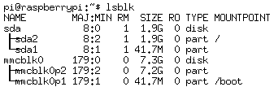
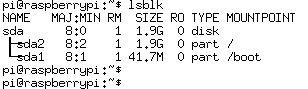

# Boot From a USB Mass Storage Device

Pi-desktop provide a mSATA to USB bridge on board,wich allow you expand your file storage space using a SSD. And you also can move your rootfs to the SSD.
In fact,a SSD + mSATA to USB bridge = a USB Mass Storage Device. 

As we know，Pi has two partition on disk(take the debian for example),The boot partition and the root partition. The boot partition is FAT format and the root partition is EXT4 format.The boot partition contains files about firmware,just like zImage,dtb,config.txt and so on. The EXT4 partition contains the rootfs.

When pi is powered up. The BCM2837 SOC will find the firmware in SD card by default to boot the linux kernel.Then the kernel will mount the rootfs. In the past time the location of root fs is determined by the root property in cmdline.txt. 
But now Raspverry seems has developed a new strategy for this.Refere to [PI 3 BOOTING PART I: USB MASS STORAGE BOOT BETA](https://www.raspberrypi.org/blog/pi-3-booting-part-i-usb-mass-storage-boot/). As mentioned by Gordon Hollingworth,the Director of Software Cycles, this feature is still in beta testing.

There are two methods to boot from SSD(or other USB Mass Storage Devices). The first way is change the root property in cmdline.txt to re-choose the location of rootfs.The other way is the new strategy that is on developing. 

## Methods 1
This method is what pi-desktop has choosed.Just follow the steps:

- 1 Prepare a USB Mass Storage Device. You can use piclone to copy the contains from your SD card to the USB Mass Storage Device. Or you just flash the image downloaded from [https://www.raspberrypi.org/downloads/raspbian/](https://www.raspberrypi.org/downloads/raspbian/).
- 2 Prepare a SD card.Flash the image to it too.Change the root property in cmdline.txt. change root=/dev/mmcblk0p2 to root=/dev/sd***x***2.

> pi@raspberrypi:~$ cat /boot/cmdline.txt    
dwc_otg.lpm_enable=0 console=serial0,115200 console=tty1 root=/dev/sda2 rootfstype=ext4 elevator=deadline fsck.repair=yes rootwait

We use a script to change the root property. Please refer to [pppBoot.py](https://github.com/pi-desktop/deb-make/blob/master/readme.md).

This method has two shortcomings. First the SD card is needed. Second you must make sure you USB Mass Storage Device is recognized as sd***x***. where ***x*** is what you write in cmdline.txt.

See this figure,the boot is in SD card and the root is in USB:

## Methods 2

This method is a really way to boot from USB without SD card. You don't need a SD card. The boot partion is stored in USB mass storage device too.

But first you need a SD card to set the OTP bit.

Just follow the steps：

- 1 First, Flash the SD card with [up to date boot files](https://www.raspberrypi.org/downloads/raspbian/): Note The old files may not works.

- 2 Then enable USB boot mode with this code:

> echo program_usb_boot_mode=1 | sudo tee -a /boot/config.txt

This adds program_usb_boot_mode=1 to the end of /boot/config.txt. 
before reboot the OTP bit is like this:

> pi@raspberrypi:~$ vcgencmd otp_dump | grep 17:   
17:1020000a

Then reboot the Raspberry Pi with sudo reboot, then check that the OTP has been programmed with:

> pi@raspberrypi:~$ vcgencmd otp_dump | grep 17:   
17:3020000a

Ensure the output 0x3020000a is shown. If it is not, then the OTP bit has not been successfully programmed. If so the SD card is not required.

- 3 Prepare the USB mass storage device
Just flash the [up to date boot files](https://www.raspberrypi.org/downloads/raspbian/) to you USB mass storage device. Then plug it to PI and remove the SD card.

See this figure,the boot partition and root partition are all exist in the U disk:

The root property is changed to a partition UUID:

> pi@raspberrypi:~$ cat /boot/cmdline.txt    
dwc_otg.lpm_enable=0 console=serial0,115200 console=tty1 root=PARTUUID=e7c74244-02 rootfstype=ext4 elevator=deadline fsck.repair=yes rootwait quiet splash plymouth.ignore-serial-consoles

For more details just refer to [How to boot from a USB Mass Storage Device on a Raspberry Pi 3](https://github.com/raspberrypi/documentation/blob/master/hardware/raspberrypi/bootmodes/msd.md).

Note that any change you make to the OTP is permanent and cannot be undone.That means  
you can not set this bit from 1 to 0. But don't worry about if you can boot from SD card again.Just plug your SD card in then power on it. This methord just add a choice for booting. The SD card has a higher priority than the U disk when booting.
As talked not all USB Mass Storage Device is supported.

