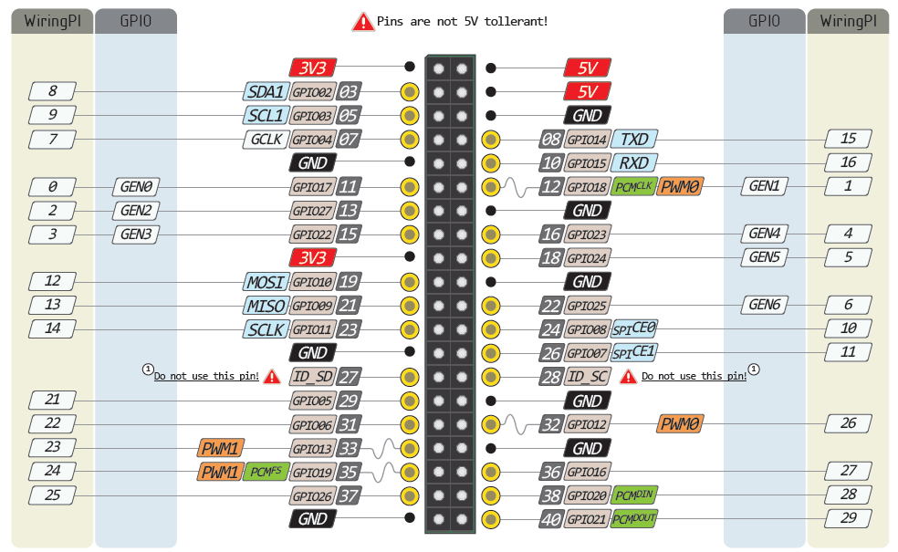

# Pins-used-by-pi-desktop

In order to achieve reliable power control and RTC the following pins on Pi is used by Pi-desktop. Except the two pins of I2C, please do not use the other pins listed in the table,otherwise there may be a problem. And the I2C pin just can be used as I2C but can not be General IO.

| GPIO   | Fuction on Pi-desktop | Detials |
|--------|-----------------------|---------|
| GPIO6  |[Pin2](https://github.com/pi-desktop/safety-power-control/blob/master/safety-power-control.md)| The state of Pi,was read by the MCU |
| GPIO13 | [Pin1](https://github.com/pi-desktop/safety-power-control/blob/master/safety-power-control.md)| The pulse signal from MCU to Pi|
| GPIO17 | RTC_INTn              |  interrupt signal of RTC |
| GPIO2  | RTC_SDA/MCU_SDA       |  SDA  for both RTC and MCU|
| GPIO3  | RTC_SCL/MCU_SCL       |  SCL  for both RTC and MCU|
| GPIO26 | INT_MCU               |  A gpio connected to MCU(reserved)|
| GPIO19 | NRST_MCU              |  Rest of MCU |

About the The Safety Power Control please refer to [The Safety Power Control for Pi-desktop](https://github.com/pi-desktop/safety-power-control/blob/master/safety-power-control.md).     

   

       

       

   

 