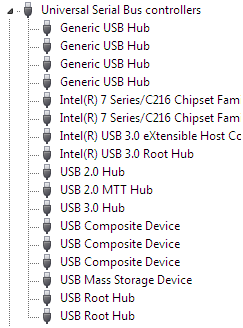
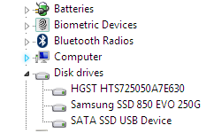
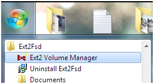
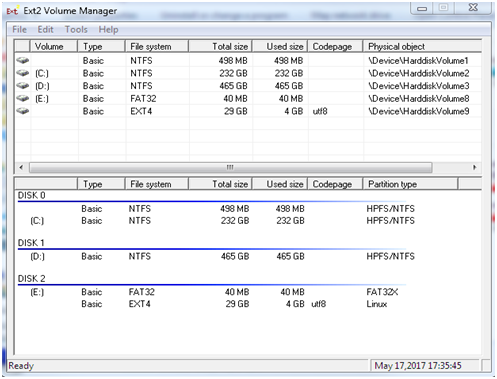
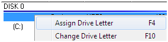
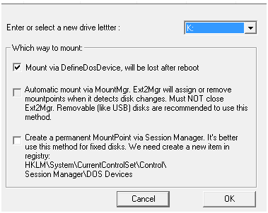
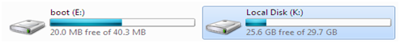
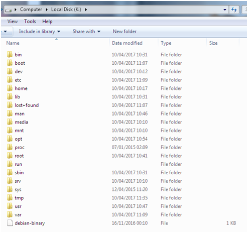

## MICROSOFT WINDOWS
Thanks to an open source project called Ext2Fsd (Ext2 File System Driver) it is now possible to very easily mount linux FS onto Microsoft Windows OS.

You can download and install the software from these websites:

[http://www.ext2fsd.com/](http://www.ext2fsd.com/)    
[https://sourceforge.net/projects/ext2fsd/](https://sourceforge.net/projects/ext2fsd/)

To install the software you will need to have administrative rights on the computer you’re installing it onto, and the ability to install the required system drivers. Afterwards you will likely have to reboot.

After you have connected the mSATA SSD HAT board to your computer, you will see it in Windows device manager as a USB Mass Storage Device and also as a drive:

From the start menu, you will want to open the ‘Ext2Fsd’ folder and then ‘Ext2 Volume Manager’:

From the software we can then see the partitions of all of the drives listed, including the identified ext. FS:

Since in this an example, we have already imaged the mSATA SSD with Raspbian, a FAT32x partition is listed (drive E:). It is the EXT4, Linux FS we want below it:

 

Make sure we want to give it a drive letter so we can access it; there are various mounting options you can choose from.

 

Windows Explorer then has the new drive listed, which we can then open and view the Linux EXT FS:

You can now alter the files and unmount them as necessary.
