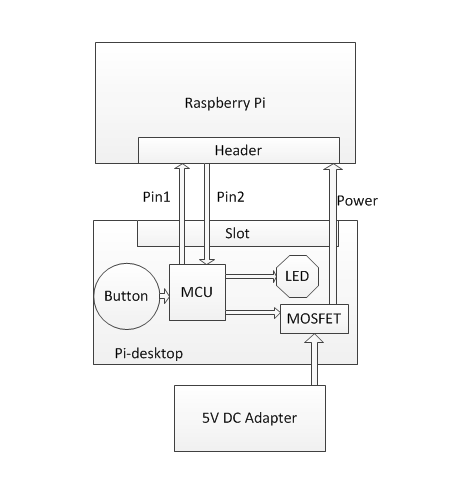
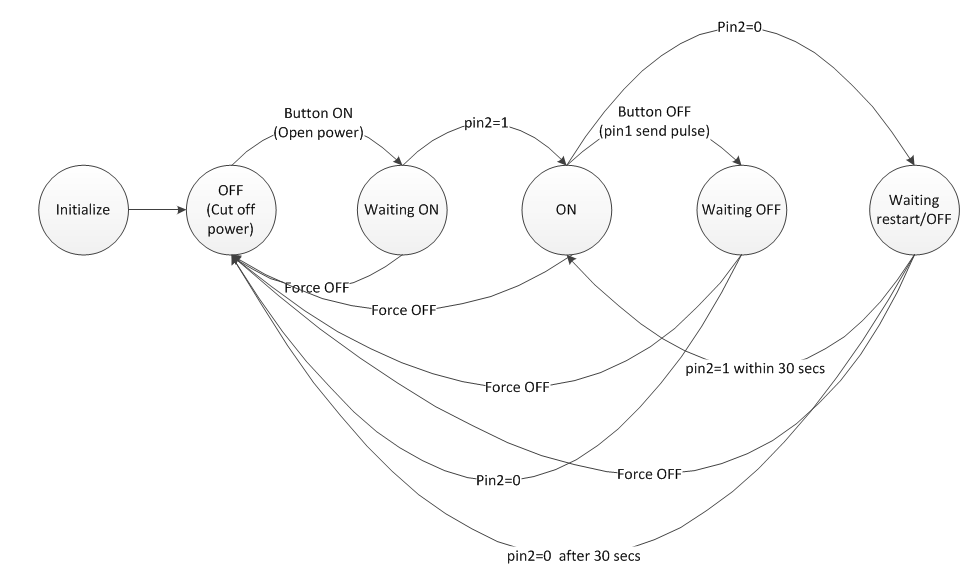
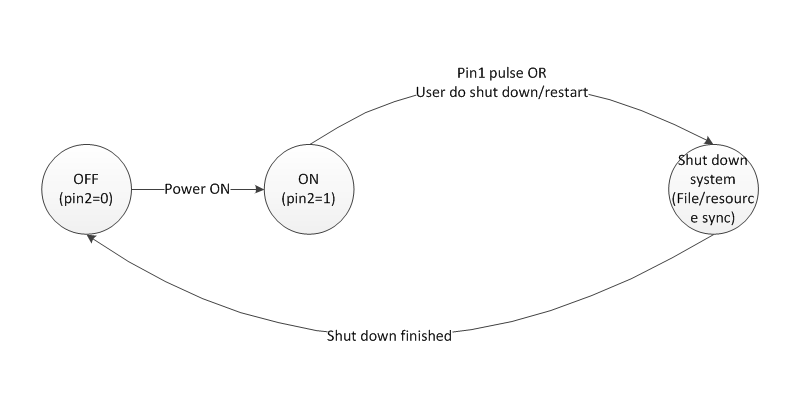

# The Safety Power Control for Pi-desktop

Like other Demo boards,The Pi dose not have a button to switch on or off. The plug  and unplug way is not safe for the hardware and filesystem. Power off directly is very dangerous for a computer that is running.And it's not convenient for the user. Imagine when you want to shut down, but do not want to lose the work being done, you need to click on the off button on GUI or type command on console, then wait for the shutdown completed, and finally unplug the power. This is a very troublesome thing.

If we want to make the Pi to a real desktop, the power control must be good enough like we use a normal PC.

## Hardware
Pi-desktop using a simple and effective way to do that. Bellow is the hardware architecture. 

A low power MCU is used to control the power and keep watch on the state of Pi. We use 2 pins to comunicate betwen Pi and Pi-desktop board. The comunication is duplex. Close-cycle control make it robust. The switch on/off action becomes safe and reliable. Pin1 is used to info Pi to prepare for shutdown. Pin2 is the run state of Pi. MCU will read pin2 all the time.

|    Action       |         Press button time          |
|-----------------|------------------------------------|
|    Switch on    |        at least 150ms              |
|    Switch off   |          2 seconds                 |
|Force switch off |          5 seconds                 |

## software
Firmware run on MCU collaborate with Pi through Pin1 and Pin2.Bellow are the detials of the FSM(finite state machine).

### MCU side:

- The MCU run into **Initialize** state after USB power plug in.Then go to **OFF**,The power supply for Pi is shutdown. LED truns off.
- When power on button action is detected, open the power for Pi. go to **Waiting ON** state.
- On **Waiting ON**, reading Pin2's level.If Pin2=1,go to **ON** state.
- On **ON** state,LED truns on.if power off button action is detected,go to **Waiting OFF** state.
- On **ON** state,if Pin2=0,go to **Waiting restart/OFF** state.
- On **Waiting OFF** state,if Pin2=0,go to **OFF** state.
- On **Waiting restart/OFF** state,LED truns blink.if Pin2=1 within 30 seconds,go to **ON** state.
- On **Waiting restart/OFF** state,LED truns blink.if Pin2=0 after 30 seconds,go to **OFF** state.
- On some states(except **Initialize** and **OFF**) if the force switch off action is detected, The power will  be unconditionally closed.

The firmware flow-chat on MCU is:

### Pi side
- After power on,go to **ON** state. Set Pin2=1.
- On **ON** state,if Pin1 pulse comes or User do shut down/restart go to **Shut down system** state and sync the file system.Then go to **OFF** state.

The software flow-chat on Pi:

The Power control strategy makesure that the power is cut off after Pi has been totally shutdown. This is important for the safety of the flash chip and the filesystem based on it. With out this you may encounter long time of file system checking or even the situation that the system cannot start up after abnormal power un-plug.

